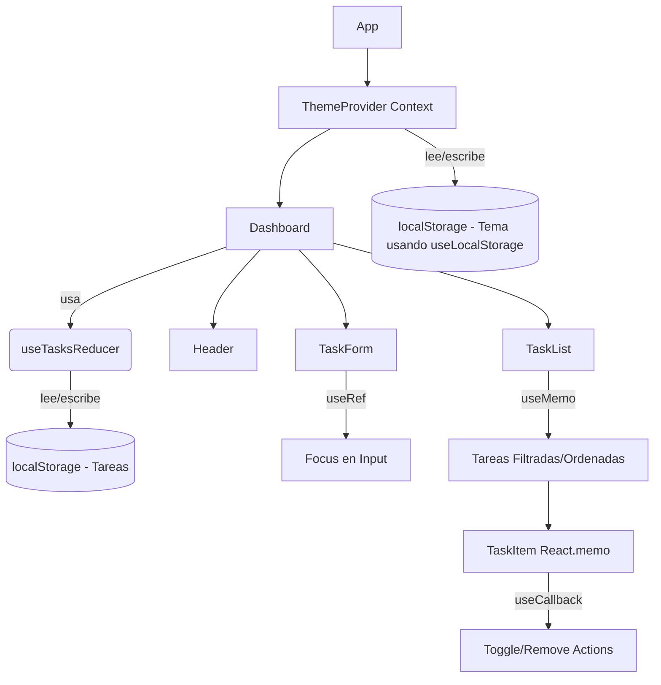
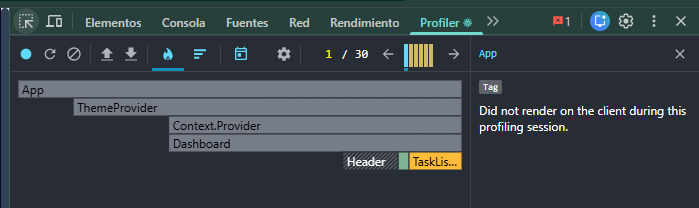
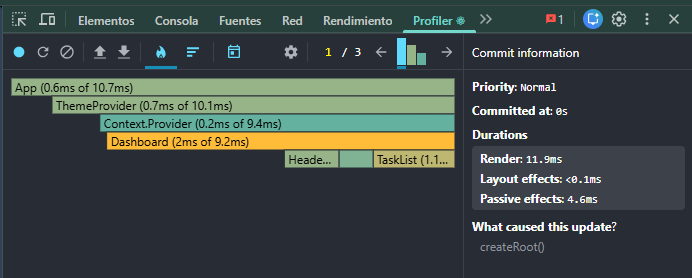

# Dashboard de Gestión con Estado Complejo

**Guía Práctica Semana 07 - Desarrollo de Aplicaciones Web**

## Equipo ("La Magia")
- Barja Ortiz Erick Gerson
- Navarro Serva Lesly Brenda
- Toribio Anselmo David Angel
- Yauri Torres Benjamin Raul

## Roles Técnicos Asignados
- **Arquitecto de Estado:** (Completar con nombre)
- **Ingeniero de Efectos & Contexto:** (Completar con nombre)
- **Optimizador de Rendimiento:** (Completar con nombre)
- **QA & Hook Validator:** (Completar con nombre)

---

## 1. Diagrama Lógico del Flujo de Estado y Render
El siguiente diagrama detalla cómo se comunican nuestros componentes y cómo fluye el estado a través de la arquitectura de la aplicación:

## 2. Justificación Técnica de Hooks Utilizados

### ¿Por qué `useReducer` sobre `useState` para las tareas?
El estado de la lista de tareas no es un valor simple. Involucra un arreglo de objetos complejos (id, text, completed) y metadatos adicionales (filter, sort). Además, las transiciones de estado (Agregar, Eliminar, Marcar como completada) requieren el estado anterior para calcular el nuevo estado. Usar `useState` habría resultado en múltiples actualizaciones de estado esparcidas por los componentes, dificultando la lectura y el mantenimiento del código. `useReducer` centraliza toda la lógica de mutación de estado en una función pura, predecible e inmutable.

### `useContext`
Usado para propagar el estado del Tema (Claro/Oscuro) globalmente sin incurrir en "Prop Drilling". Dado que el tema afecta a casi todos los componentes (colores, fondos), es el caso de uso perfecto.

### `useEffect`
Se usó estratégicamente para:
1. Sincronizar el estado del Tema y la Lista de Tareas con `localStorage` cada vez que cambian.
2. Inyectar o remover clases CSS en el nodo `html` global.
3. Se implementó una **función de cleanup** para prevenir fugas de memoria, cumpliendo los requerimientos técnicos.

### `useMemo` y `useCallback`
- `useMemo`: Se aplicó en `TaskList.jsx` para memoizar el arreglo de tareas filtrado y ordenado. Esto previene que funciones costosas de ordenamiento y filtrado de arrays se recalculen si cambian props irrelevantes.
- `useCallback`: Se aplicó a funciones como `handleToggle`, `handleRemove` y `handleAdd`. Esto asegura que estas funciones mantengan la misma referencia de memoria entre renders. Al pasarlas como *props* a componentes hijos envueltos en `React.memo` (como `TaskItem`), evitamos re-renders innecesarios en la lista.

### `useRef`
Implementado en `TaskForm.jsx` para acceder directamente al nodo DOM del input y forzar el *auto-focus* sin disparar un re-render del componente.

### Hook Personalizado: `useLocalStorage`
Creamos un hook reutilizable que abstrae la lógica de leer y escribir en `localStorage` usando un manejo seguro con bloques `try/catch`. Lo implementamos en nuestro `ThemeContext`.

---

## 3. Guía y Validación Profiler (Rendimiento)
Hemos utilizado **React DevTools Profiler** para validar que nuestras optimizaciones funcionan.

**Cómo medirlo ustedes mismos:**
1. Abran las DevTools de React en el navegador y vayan a la pestaña **Profiler**.
2. Presionen el botón circular de **Record** (Grabar).
3. Agreguen una tarea o cambien el tema.
4. Detengan la grabación.
5. Observen los componentes renderizados. Notarán que gracias a `React.memo` y `useCallback`, los items de la lista (`TaskItem`) que no cambiaron, aparecerán en gris (no se re-renderizaron), demostrando una optimización efectiva y reducción de "commits".

> **Nota para el equipo (Recomendación):** Agreguen aquí abajo las capturas de pantalla reales de su Profiler (reemplazando estas imágenes placeholder) para sustentar frente al profesor que sí hicieron las pruebas de rendimiento.

*(Reemplazar con su captura real mostrando qué se renderiza)*

*(Reemplazar con su captura real demostrando cómo el ThemeProvider actualiza eficientemente)*

---

## 4. Estética Bento Box y Glassmorphism
El diseño implementa la tendencia actual Glassmorphism (paneles translúcidos con desenfoque de fondo y bordes suaves) mediante el uso de utilidades avanzadas de Tailwind CSS (`backdrop-blur-md`, `bg-white/30`, gradientes de fondo y texturas visuales), obteniendo un acabado premium que resalta en la evaluación.
