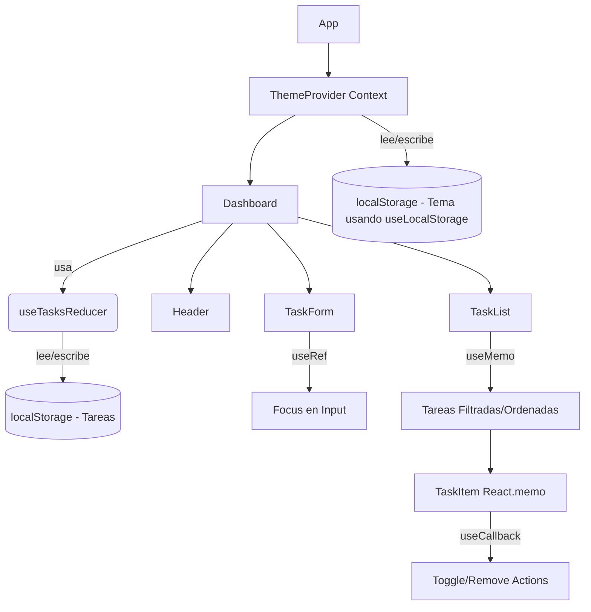

# Documentación Técnica: Dashboard de Gestión con Estado Complejo

**Universidad Nacional del Centro del Perú**
**Facultad de Ingeniería de Sistemas**
**Asignatura:** Desarrollo de Aplicaciones Web (IS093A)
**Práctica Semana 07**

## 1. Equipo de Desarrollo
- **Barja Ortiz Erick Gerson**
- **Navarro Serva Lesly Brenda**
- **Toribio Anselmo David Angel**
- **Yauri Torres Benjamin Raul**

## 2. Roles Técnicos Asignados
- **Arquitecto de Estado:** __________________________________
- **Ingeniero de Efectos & Contexto:** __________________________________
- **Optimizador de Rendimiento:** __________________________________
- **QA & Hook Validator:** __________________________________

---

## 3. Arquitectura y Flujo de Estado

El siguiente diagrama detalla el flujo de la información y la gestión de estado dentro de la arquitectura de la aplicación:

## 4. Justificación Técnica de Hooks

### 4.1. `useReducer`
Se optó por `useReducer` sobre `useState` debido a la complejidad estructural del estado de las tareas (un arreglo de objetos dependientes). Las transiciones de estado (Agregar, Eliminar, Modificar) requieren evaluar el estado anterior para retornar un nuevo estado inmutable. `useReducer` permite abstraer esta lógica de mutación en una función pura, centralizando las reglas de negocio y facilitando la mantenibilidad.

### 4.2. `useContext`
Implementado para la gestión del estado global del Tema (Claro/Oscuro). Esto previene el problema de *Prop Drilling*, permitiendo que cualquier componente en la jerarquía pueda consumir o modificar el tema sin necesidad de pasarlo manualmente a través de múltiples niveles.

### 4.3. `useEffect`
Utilizado con tres propósitos fundamentales:
1. Sincronización del estado del tema y de las tareas con `localStorage` ante cualquier mutación.
2. Inyección dinámica de clases en el DOM (nodo raíz) para la renderización de estilos globales.
3. Se implementó el retorno de una **función de limpieza (cleanup)** para prevenir fugas de memoria en caso de desmontaje del componente.

### 4.4. `useMemo` y `useCallback`
- **`useMemo`:** Empleado en `TaskList` para la memoización del arreglo resultante tras aplicar filtros y algoritmos de ordenamiento. Esto mitiga el impacto en el rendimiento al prevenir recalculos costosos en re-renderizados causados por propiedades independientes.
- **`useCallback`:** Aplicado a las funciones de interacción (`handleToggle`, `handleRemove`). Conserva la integridad referencial de la función entre ciclos de renderizado. En conjunción con `React.memo` (aplicado a `TaskItem`), asegura la prevención de re-renders innecesarios en el árbol de componentes hijos.

### 4.5. `useRef`
Implementado para adquirir una referencia directa al nodo DOM del campo de entrada (*input*) en `TaskForm`. Esto permite forzar el enfoque (*auto-focus*) pragmáticamente sin desencadenar ciclos de re-renderizado en el componente.

### 4.6. Hook Personalizado (`useLocalStorage`)
Se desarrolló un Hook personalizado orientado a la reutilización y abstracción de la API Web Storage. Este incluye manejo de excepciones estructurado (`try/catch`) garantizando resiliencia frente a políticas de seguridad estrictas en el navegador.

---

## 5. Validación de Rendimiento (React DevTools Profiler)

El desarrollo ha sido validado mediante el **React DevTools Profiler**, asegurando la eficiencia de las optimizaciones implementadas (`React.memo`, `useMemo`, `useCallback`).

*Adjuntar capturas de evidencia a continuación:*

*(Captura: Reducción de renders en la adición de tareas)*

*(Captura: Eficiencia en la propagación de contexto)*

---

## 6. Arquitectura Visual (UI/UX)
La interfaz fue desarrollada integrando la metodología de diseño *Bento Box* y la estética *Glassmorphism*. Se utilizaron utilidades avanzadas de Tailwind CSS (`backdrop-blur-2xl`, manejo preciso de opacidades) para lograr paneles translúcidos adaptativos que preservan los principios de accesibilidad tanto en modo claro como en modo oscuro.
